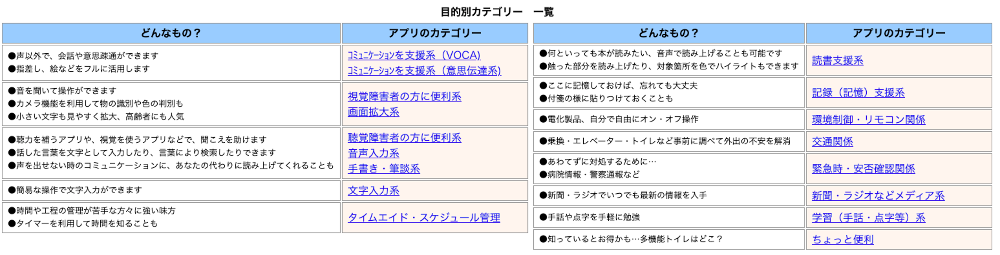

## 本章のまとめ
AI for Accessibility を紹介
特化型AI：教えたデータをもとに特定のタスクを自動処理
音声認識、画像認識、機械翻訳、自動要約・・・
アクセシビリティと特化型AIは相性が良い
AIでサポートを自動化すると、「少ない労力で」「大量の情報を」が得られる
従来、周囲のサポートが無いと情報が得られなかった人たちが活躍できる
AI for Accessibility のアプリケーションが増えるには、いろいろ壁がある
いちばん大きいのは、事業化・産業化の壁
事業化・産業化（認知してもらう、儲かると思ってもらう）のためには、地道な発信もそれなりに重要なので、ぜひ使用感を発信してみてください

## 付録
参考：障害のある人に便利なアプリ一覧（AIではないものも含む）

東京都障害者IT地域センターが公開。
* [iOS版](https://www.tokyo-itcenter.com/700link/sm-iphon4.html)
* [Android版](https://www.tokyo-itcenter.com/700link/sm-and1.html)

