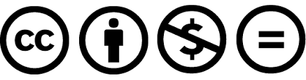

# 謝辞
本原稿の執筆に当たり、筆者の周囲の人々から多くの協力を頂いた。この場を借りて感謝を表す。
本資料の執筆には[gitbook](https://www.gitbook.com/)を用いた。
また、本資料は[『当事者に学ぶ視覚・聴覚障がい者のセルフアドボカシープログラム』](https://self-advocacy.themedia.jp/)の一環として作成されている。

# 著者紹介

近藤 真暉（会社員 / 日本社会事業大学 非常勤講師）

# ライセンス
本資料は [CC BY-NC-ND 4.0](https://creativecommons.org/licenses/by-nc-nd/4.0/) に従うライセンスで公開している。
教育など非商用の目的での本教科書の使用や再配布は自由に行うことが可能である。
商用目的で本書の全体またはその一部を無断で転載する行為は、これを固く禁じる。

